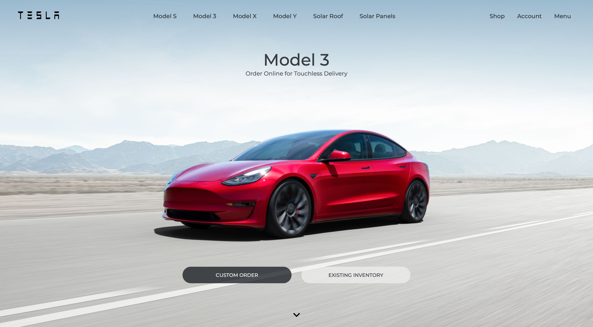
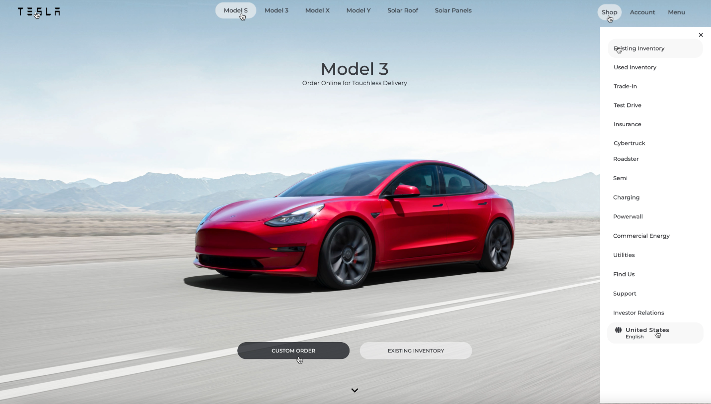
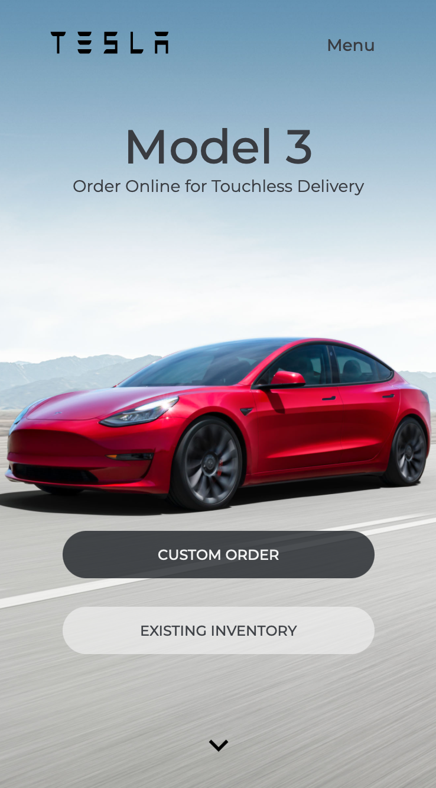

# Tesla Clone

This is a cloned website of the official Tesla page built with React JS. The page has simillar sections which made it easier to build reusable components with React.

## Table of Contents

- [Overview](#overview)
  - [Screenshots](#screenshots)
  - [Links](#links)
- [My process](#my-process)
  - [Built with](#built-with)
  - [Features](#features)
- [Author](#author)

## Overview

### Screenshots

### Links

- Live Site URL: [Vercel](https://react-tesla-clone-nesdevs.vercel.app/#)
## My Process

### Built With

- React.js
- Redux
- Styled Components

### Features

- View the optimal layout depending on their device's screen size
- See hover states for all interactive elements on the page

## Author

- Frontend Mentor - [@Reallyvane](https://www.frontendmentor.io/profile/Reallyvane)
- Twitter - [@OfficialNesDevs](https://twitter.com/OfficialNesDevs)

